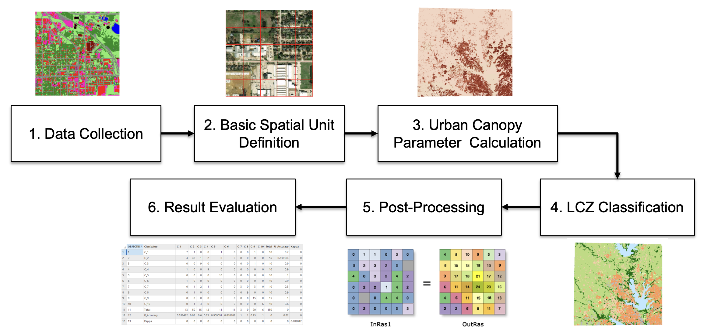
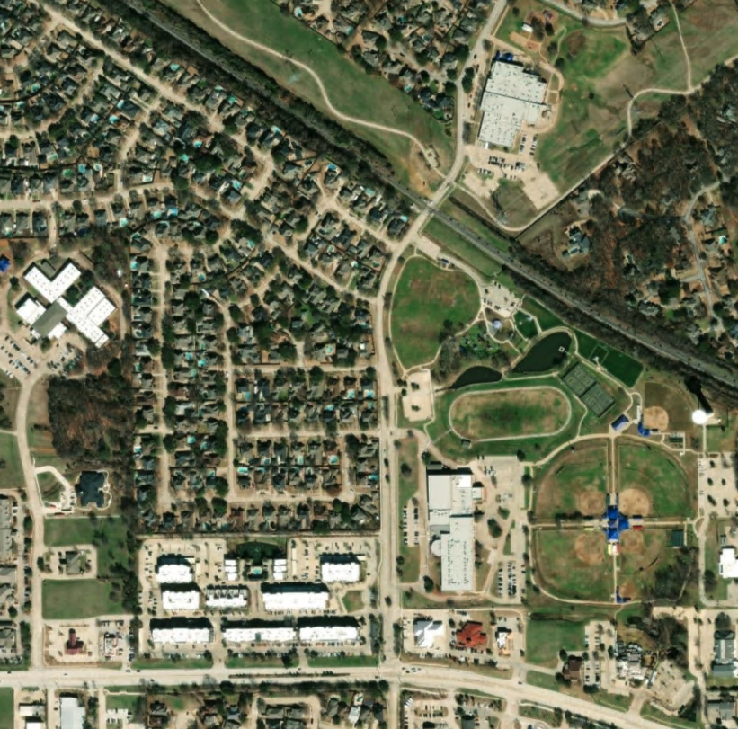
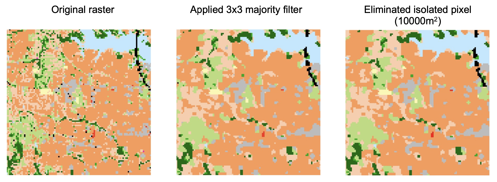
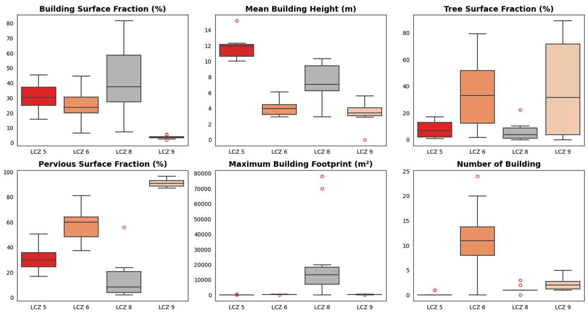

  

    
  

# Introduction
The Local Climate Zone (LCZ) classification system offers the standardization of urban heat island studies and addresses the shortcomings of the urban-rural division (Stewart & Oke 2012). Given the increasing interest in the applications of LCZ, this project aims to present an efficient and adaptable GIS-based LCZ mapping framework within the United States. A modified standard rule-based approach was used to map 100-meter resolution LCZs in Denton County, Texas. All mapping procedure was performed in ArcGIS Pro 3.3.

Product I (gisLCZ_v1.tif) uses the orginial classification scheme while Product II (gisLCZ_v2.tif) adds a new class by combining open lowrise with low plants to represent open lowrise area with minimal tree cover. Both products use the following coding:

| Band Value v1 | Band Value v2 |LCZ | Label |
|----------|----------|----------|----------|
| 0 | 0 | null | null |
| 1 | 1 | B | Scattered trees |
| 2 | 2 | D | Low plants |
| 3 | 3 | 8 | Large lowrise |
| 4 | 4 | 9 | Sparsely built |
| 5 | 5 | G | Water |
| 6 | 6 | A | Dense trees |
| 7 | 7 | F | Bare soil or sand |
| 8 | 8 | E | Bare rock or paved |
| 9 | 10 | 6 | Open lowrise |
| n/a | 9 | 6D | Open lowrise & low plants |
| 10 | 11 | 5 | Open midrise |

## Code
The notebook comprises four parts. Part I illustrates the LCZ mapping procedure, and Part II shows how to perform a confusion matrix to evaluate the accuracy. Part III & IV are optional steps to evaluate the inter-zonal thermal and building properties. 

*Classification rules may not be transferable and may require user adjustment, depending on the study area. It is recommended to check the distribution of the UCPs values first.*

# Input Data 
| Data | Resolution | Source |
|----------|----------|----------|
| Building Footprint | / | [Microsoft Building Footprint](https://github.com/microsoft/USBuildingFootprints) |
| Land cover | 1 meter | [UrbanWatch](https://urbanwatch.charlotte.edu/)  |
| Tree/ building height | 1 meter | Derived from LiDAR tiles from [TxGIO](https://tnris.org/)|

# Urban Canopy Parameters
Seven indicators were used in the decision tree to classify LCZs.

1. Maxmium building footprint (m²)
2. Number of building
3. Mean building height (m)
4. Building surface fraction (%)
5. Majority landcover
6. Tree canopy surface fraction (%)
7. Pervious surface fraction (%)

# Basic Spatial Unit

  

    
    
  

Due to the homogeneity of building height in Denton County, this approach simply used a 100-meter grid as opposed to performing a spatial autocorrelation analysis.

# Post Processing
A two stage post processing were performed. In the first stage, a 3x3 moving window were used to keep the majority value. In the second stage, isolated pixel (polygon equal to 10,000m²) were aggregated to the neighboring polygon with the largest area. You can adjust this threshold to homogenize the result.

  

    
  

# Evaluation
150 samples were generated using stratified random sampling. Each of the LCZ has at least 10 samples. High resolution satellite imagery was used to determine the groundtruth.

The overall accuracy is 82% and the kappa coefficient is 0.78.

| LCZ | B | D | 8 | 9 | G | A | F | E | 6 | 5 | Total | User Accuracy |
|:---:|:---:|:---:|:---:|:---:|:---:|:---:|:---:|:---:|:---:|:---:|:----:|:---:|
|  B  | 7 | 1 | 0 | 0 | 1 | 0 | 0 | 0 | 1 | 0 |  10   |     0.7       |
|  D  | 4 | 46| 1 | 2 | 0 | 2 | 0 | 0 | 0 | 0 |  55   |     0.84      |
|  8  | 0 | 0 | 9 | 0 | 0 | 0 | 0 | 0 | 1 | 0 |  10   |     0.9       |
|  9  | 1 | 0 | 0 | 9 | 0 | 0 | 0 | 0 | 0 | 0 |  10   |     0.9       | 
|  G  | 0 | 0 | 0 | 0 | 10| 0 | 0 | 0 | 0 | 0 |  55   |     1         |
|  A  | 1 | 0 | 0 | 0 | 0 | 9 | 0 | 0 | 0 | 0 |  10   |     0.9       |
|  F  | 0 | 1 | 2 | 1 | 0 | 0 | 3 | 0 | 3 | 0 |  10   |     0.3       | 
|  E  | 0 | 1 | 0 | 0 | 0 | 0 | 0 | 9 | 0 | 0 |  10   |     0.9       |
|  6  | 0 | 0 | 0 | 0 | 0 | 0 | 0 | 0 | 15| 0 |  15   |     1         |
|  5  | 0 | 1 | 3 | 0 | 0 | 0 | 0 | 0 | 0 | 6 |  10   |     0.6       |
|Total| 13| 50| 15| 12| 11| 11| 3 | 9 | 20| 6 |  150  |               |
|Producer Accuracy| 0.54 | 0.92 | 0.6 | 0.75 | 0.91 | 0.82 | 1 | 1 | 0.75 | 1 |     |     0.82       |

## How different are the urban canopy parameters among the built types?
A set of samples were selected among open midrise, open lowrise, large lowrise, and sparsely built to visualize their building properties.

  

    
  

## Reference
Geletič, J., & Lehnert, M. (2016). GIS-based delineation of local climate zones: The case of medium-sized Central European cities. Moravian Geographical Reports, 24(3), 2-12.

Geletič, J., & Lehnert, M. (2016). GIS-based delineation of local climate zones: The case of medium-sized Central European cities. Moravian Geographical Reports, 24(3), 2-12.

Stewart, I. D., & Oke, T. R. (2012). Local climate zones for urban temperature studies. Bulletin of the American Meteorological Society, 93(12), 1879-1900.

Zheng, Y., Ren, C., Xu, Y., Wang, R., Ho, J., Lau, K., & Ng, E. (2018). GIS-based mapping of Local Climate Zone in the high-density city of Hong Kong. Urban climate, 24, 419-448.

