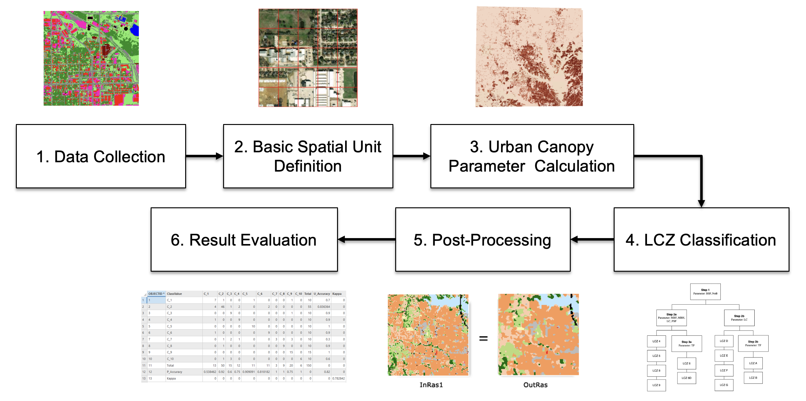
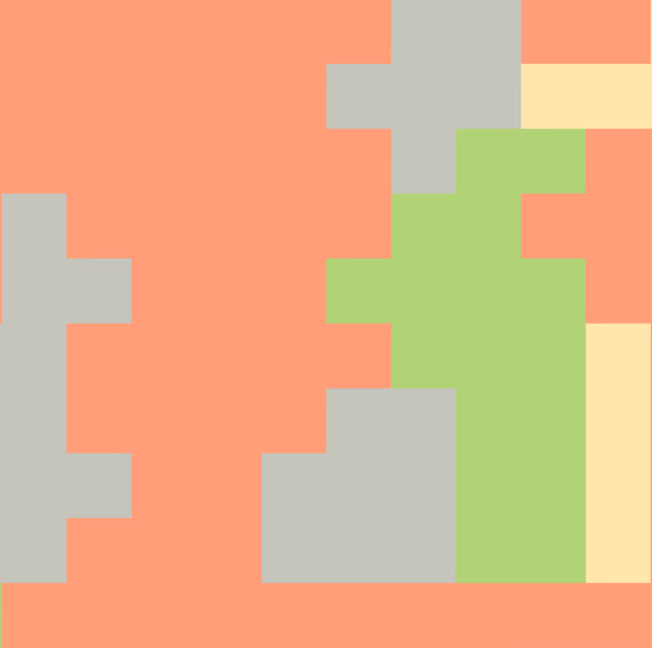

  

    
  

# Introduction
The Local Climate Zone (LCZ) classification system offers the standardization of urban heat island studies and addresses the shortcomings of the urban-rural division (Stewart & Oke 2012). Given the increasing attention in LCZ, this project aims to present an efficient and adaptable GIS-based LCZ mapping framework within the Uunited States. A modified standard rule-based approach was used to map 100-meter resolution LCZs in Denton County, Texas. All mapping procedure was performed in ArcGIS.

The notebook has four parts. Part I illustrates the LCZ mapping procedure while Part II shows how to perform a confusion matrix to evaluate the accuracy. Part III & IV are optional steps to evaluate the thermal and building properties. The rules used in the decision tree may not be transferable and may require user adjustment depending on the study area.

| Band Value | LCZ | Label |
|----------|----------|----------|
| 5 | 5 | Scattered trees |
| 6 | 6 | Low plants |
| 8 | 8 | Large lowrise |
| 9 | 9 | Sparsely built |
| 11 | A | Dense trees |
| 12 | B | Scattered trees |
| 14 | D | Low plants |
| 15 | E | Bare rock or paved |
| 16 | F | Bare soil or sand  |
| 17 | G | Water |
| 18 | 6D | Open lowrise & low plants |

# Input Data 
| Data | Resolution | Source |
|----------|----------|----------|
| Building Footprint | / | [Microsoft Building Footprint](https://github.com/microsoft/USBuildingFootprints) |
| Land cover | 1 meter | [UrbanWatch](https://urbanwatch.charlotte.edu/)  |
| Tree/ building height | 1 meter | Derived from LiDAR tiles from [TxGIO](https://tnris.org/)|

# Urban Canopy Parameters

Seven indicators were used in the decision tree to classify LCZs.

1. Maxmium building footprint (m²)
2. Number of building
3. Mean building height (m)
4. Building surface fraction (%)
5. Majority landcover
6. Tree canopy surface fraction (%)
7. Pervious surface fraction (%)

# Basic Spatial Unit

  

    
    
  

Due to the homogeneity of building height in Denton County, this approach simply used a 100-meter grid as opposed to performing a spatial autocorrelation analysis.

# Evaluation
150 samples were generated using stratified random sampling. Each of the LCZ has at least 10 samples. High resolution satellite imagery was used to determine the groundtruth.

The overall accuracy is 82% and the kappa coefficient is 0.78.

| LCZ | B | D | 8 | 9 | G | A | F | E | 6 | 5 | Total | User Accuracy |
|:---:|:---:|:---:|:---:|:---:|:---:|:---:|:---:|:---:|:---:|:---:|:----:|:---:|
|  B  | 7 | 1 | 0 | 0 | 1 | 0 | 0 | 0 | 1 | 0 |  10   |     0.7       |
|  D  | 4 | 46| 1 | 2 | 0 | 2 | 0 | 0 | 0 | 0 |  55   |     0.84      |
|  8  | 0 | 0 | 9 | 0 | 0 | 0 | 0 | 0 | 1 | 0 |  10   |     0.9       |
|  9  | 1 | 0 | 0 | 9 | 0 | 0 | 0 | 0 | 0 | 0 |  10   |     0.9       | 
|  G  | 0 | 0 | 0 | 0 | 10| 0 | 0 | 0 | 0 | 0 |  55   |     1         |
|  A  | 1 | 0 | 0 | 0 | 0 | 9 | 0 | 0 | 0 | 0 |  10   |     0.9       |
|  F  | 0 | 1 | 2 | 1 | 0 | 0 | 3 | 0 | 3 | 0 |  10   |     0.3       | 
|  E  | 0 | 1 | 0 | 0 | 0 | 0 | 0 | 9 | 0 | 0 |  10   |     0.9       |
|  6  | 0 | 0 | 0 | 0 | 0 | 0 | 0 | 0 | 15| 0 |  15   |     1         |
|  5  | 0 | 1 | 3 | 0 | 0 | 0 | 0 | 0 | 0 | 6 |  10   |     0.6       |
|Total| 13| 50| 15| 12| 11| 11| 3 | 9 | 20| 6 |  150  |               |
|Producer Accuracy| 0.54 | 0.92 | 0.6 | 0.75 | 0.91 | 0.82 | 1 | 1 | 0.75 | 1 |     |     0.82       |

### How different are the urban canopy parameters among the built types?
A set of samples were selected among open midrise, open lowrise, large lowrise, and sparsely built to visualize their building properties.

  

    
  

